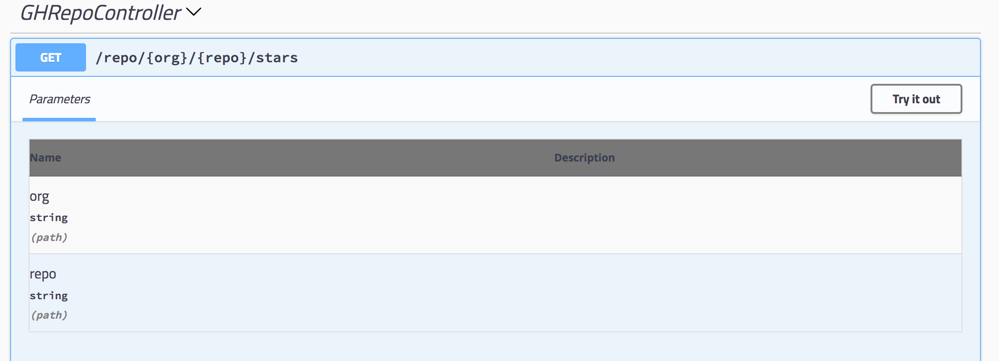

In this series, we will work through creating a basic LoopBack 4 application that exposes REST APIs; calls out to GitHub APIs through [octokat.js](https://github.com/philschatz/octokat.js) (a GitHub API client) to get the number of stargazers on a user-specified GitHub organization and repository; and persists the data into a Cloudant database.


<!--more-->
The series is organized as follows:

Part 1: Scaffolding a LoopBack 4 application and creating REST API

Part 2: Adding logic to a controller to talk to GitHub API

Part 3: Persisting data to Cloudant database using `DataSource` and `Repository`

## Before You Begin

Make sure you have [Node.js](https://nodejs.org/en/download/) v8 or higher installed. Since we will be using the LoopBack 4 [CLI](http://loopback.io/doc/en/lb4/Command-line-interface.html) to get started, install `@loopback/cli` as well. 

Run the following command: 
```
npm i -g @loopback/cli
```

## Let's Get Started

### Step 1: Scaffolding a LB4 Application

Use `lb4` command and follow the prompts to create a new LB4 application. 

```
$ lb4
? Project name: loopback4-github-app
? Project description: LoopBack4 application that calls GitHub for data
? Project root directory: loopback-4-github-app
? Application class name: GitHubApplication
? Select project build settings:  Enable tslint, Enable prettier, Enable mocha, Enable loopbackBuild

<<some more output>>
 
Application loopback4-github-app is now created in loopback-4-github-app.

Next steps:

$ cd loopback-4-github-app
$ npm start
```

Follow the next steps above and try out the `http://127.0.0.1:3000/ping` endpoint, you'll get something like:
```
{  
   "greeting":"Hello from LoopBack",
   "date":"2018-03-19T17:22:16.159Z",
   "url":"/ping",
   "headers":{  
      "host":"localhost:3000",
      "connection":"keep-alive",
      "user-agent":"Mozilla/5.0 (Macintosh; Intel Mac OS X 10_13_3) AppleWebKit/537.36 (KHTML, like Gecko) Chrome/61.0.3163.100 Safari/537.36",
      "upgrade-insecure-requests":"1",
      "accept":"text/html,application/xhtml+xml,application/xml;q=0.9,image/webp,image/apng,*/*;q=0.8",
      "accept-encoding":"gzip, deflate, br",
      "accept-language":"en-US,en;q=0.8"
   }
}
```

### Step 2: Generating the Controller for Creating REST APIs

A [Controller](http://loopback.io/doc/en/lb4/Controllers.html) is where you implement the business logic. We are going to generate the controller for our REST endpoint `/repo/{org}/{repo}/stars`, which will get the number of stargazers for the user-specified GitHub organization and repository.  

Run the `lb4 controller` command as follows: 
```
$ lb4 controller
? Controller class name: GHRepo
? What kind of controller would you like to generate? Empty Controller
   create src/controllers/gh-repo.controller.ts
```
Note: the class name will be suffixed with `Controller`.

### Step 3: Create REST Endpoints in GHRepoController

Go to `GHRepoController` (in `controllers\gh-repo.controller.ts`) that was generated in the previous step, and add the following function that corresponds to the `GET /repo/{org}/{repo}/stars` endpoint:

```ts
@get('/repo/{org}/{repo}/stars') 
getRepoStargazers(
  @param.path.string('org') org: string,
  @param.path.string('repo') repo: string
): string {
  //Add some simple logic here for now to test out the API
  console.log('org/repo', org, repo);
  return '100';
}
```

You also need to add the import statement below:
```ts
import {get, param} from "@loopback/openapi-v3";
```
### Step 4: Testing the REST Endpoint

Before adding in more logic, let's test the endpoint we've just created. Run the command `npm start` to start the application.  

Go to a browser and type:
```
http://localhost:3000/swagger-ui
```
This will bring you to the API explorer where you can test your API. Try out the newly added REST API Under `GHRepoController`.



The response body should be `100` regardless of the value of the input parameters.

Tip: If you want to look at the corresponding OpenAPI specification, type in the browser:
```
http://localhost:3000/openapi.json
```

## What's Next

In part 2, we will add more logic in `GHRepoController` to talk to GitHub APIs through `octokat.js`, a GitHub API client.

## Code Repository

The code for this GitHub example application can be found [here](https://github.com/dhmlau/loopback4-github-app). The `part1` branch has everything accomplished in this article.
```
git clone https://github.com/dhmlau/loopback4-github-app.git
git checkout part1
```

## Call for Action

LoopBack's future success counts on you. We appreciate your continuous support and engagement to make LoopBack even better and meaningful for your API creation experience. Please join us and help the project by:

* [Open a pull request on one of our "good first issues"](https://github.com/strongloop/loopback-next/labels/good%20first%20issue)
* [Casting your vote for extensions](https://github.com/strongloop/loopback-next/issues/512)
* [Reporting issues](https://github.com/strongloop/loopback-next/issues)
* [Building more extensions](https://github.com/strongloop/loopback-next/issues/647)
* [Helping each other in the community](https://groups.google.com/forum/#!forum/loopbackjs)
