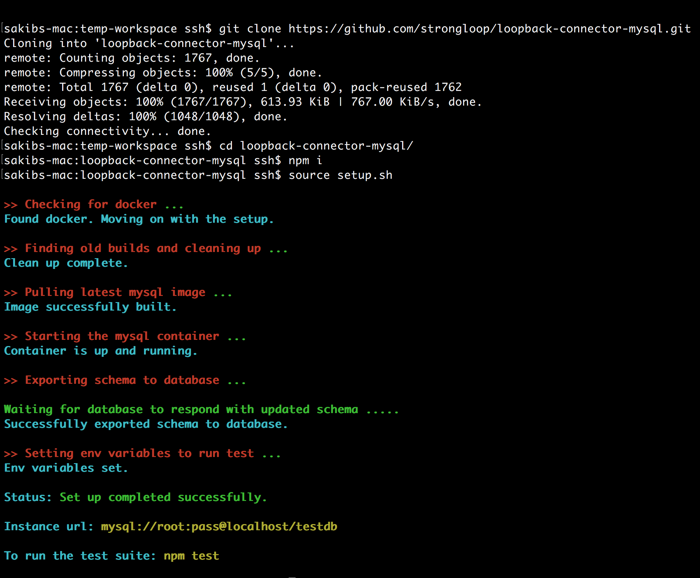

<!-- TOC -->

- [Introduction](#introduction)
- [Supported connectors](#supported-connectors)
- [How to spawn the container](#how-to-spawn-the-container)
- [Conclusion](#conclusion)

<!-- /TOC -->

## Introduction

Connectors are a vital part of LoopBack that our users heavily rely on. Most of our users use the connector modules because they have an external database service. However, others opt out in frustration of not having the luxury to use a database of their own choice. To remove this barrier, we wanted to have a simple way to set up and tear down a database service upon request of the user.

As software developers, we are always looking for ways to ease the minimal effort required to complete a job effectively. [`Docker`](https://www.docker.com/), a tool that allows packaging of an application and its dependencies into a virtual container for deployment, was the perfect solution for this problem.

Docker provides images for almost all known commercial databases which could be pulled from the [`Docker Hub Registry`](https://hub.docker.com/) and used to spawn up local containers. Once the container for the respective database service is up and running, the user can use it for development/testing purposes and dispose it when done.

## Supported connectors
- SQL Connectors
    - [MySQL](https://github.com/strongloop/loopback-connector-mysql)
    - [PostgreSQL](https://github.com/strongloop/loopback-connector-postgresql)
    - [MSSQL](https://github.com/strongloop/loopback-connector-mssql)
    - [Oracle](https://github.com/strongloop/loopback-connector-oracle)
    - [IBM DB2](https://github.com/strongloop/loopback-connector-db2)
    - [IBM Informix](https://github.com/strongloop/loopback-connector-informix)

- No-SQL Connectors
    - [MongoDB](https://github.com/strongloop/loopback-connector-mongodb)
    - [IBM Cloudant](https://github.com/strongloop/loopback-connector-cloudant)

## How to spawn the container

Each of the above [connectors](#connectors-supported) has a bash script that can be used to setup the whole dockerization process.

Currently, the script is designed to support Unix based platforms only. In the future, we will be transitioning from bash scripts to javascript programs which shall be platform independent. The basic prerequisites for running the script are:
- Install [`Docker`](https://www.docker.com/)
- Install bash shell

For example, here is the [script](https://github.com/strongloop/loopback-connector-mysql/blob/master/setup.sh) for `MySQL`. To run the script, please follow the instructions below:
- Git clone the [repository](https://github.com/strongloop/loopback-connector-mysql)
- Change directory to the cloned repository and run `npm install` to get the required dependencies
- Run the script by either:
    - Sourcing it:
        - `source setup.sh`
    - Running the script and exporting the database specific environmental variables manually
        - `sh setup.sh`
        - `MYSQL_USERNAME=<USERNAME> MYSQL_PASSWORD=<PASSWORD> MYSQL_DATABASE=<DATABASE> MYSQL_PORT=<PORT>`

For more information on how to run the customized shell script, please read the docs on each respective repository.

For example, visit [How to run tests on MySQL](https://github.com/strongloop/loopback-connector-mysql#running-tests) for more information.

**Below is a snapshot of how to run the script to setup a docker for MySQL connector:**

## Conclusion

This new feature will allow our community contributors to come forward and use LoopBack even more. Thanks to Docker, it has never been easier to contribute code in all LoopBack connector modules.

Lowering these barriers improve the contribution experience for all, and we'd love to see your contributions in the future!
