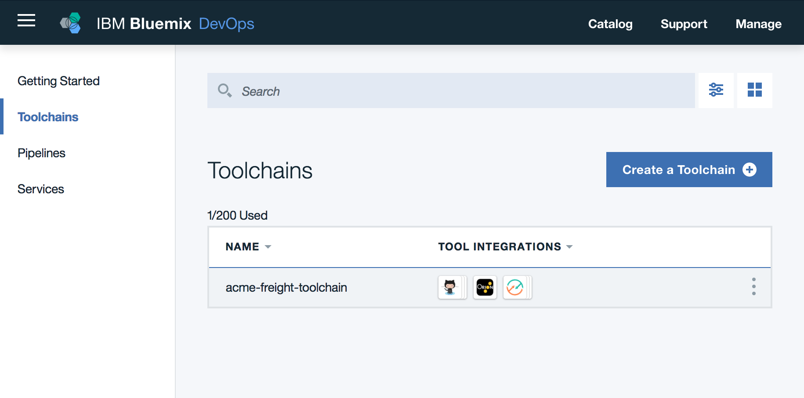
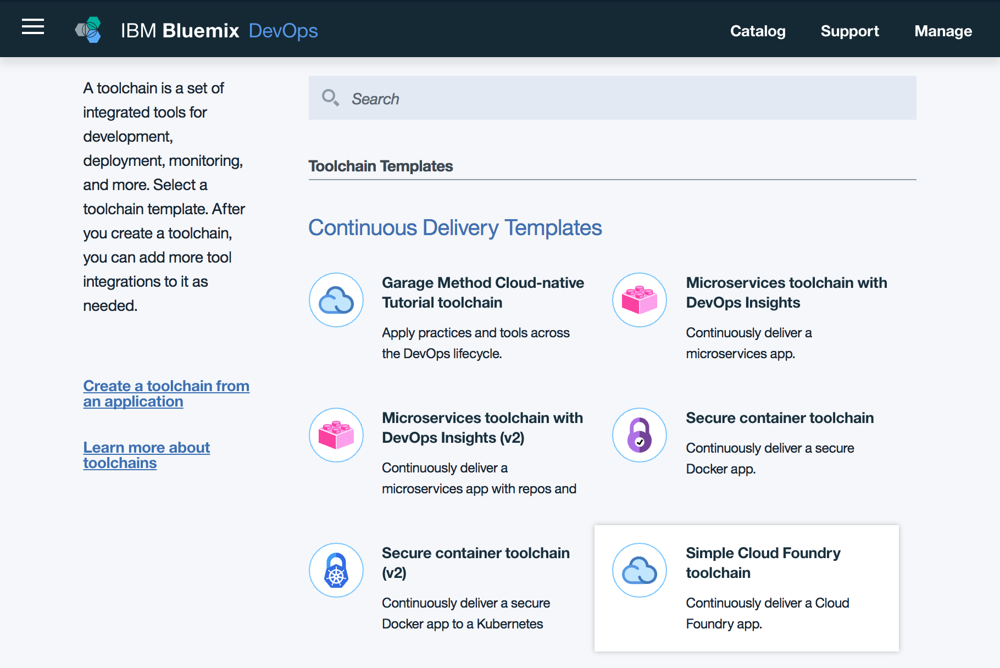
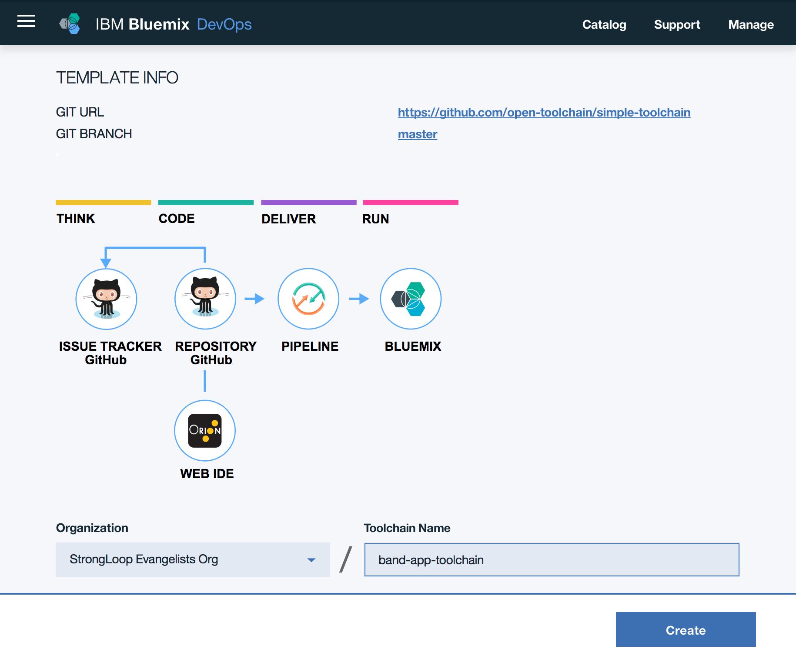
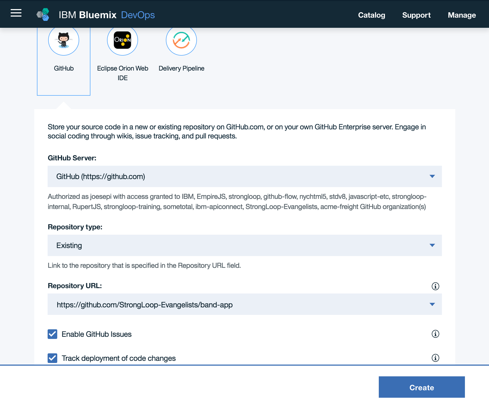
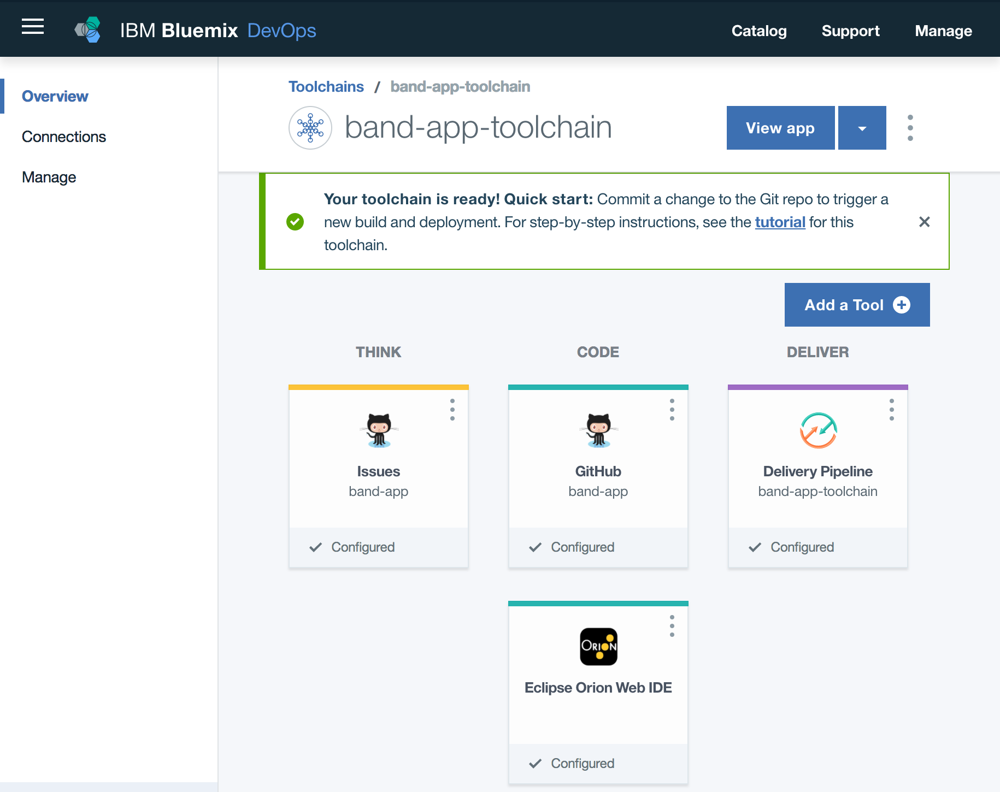
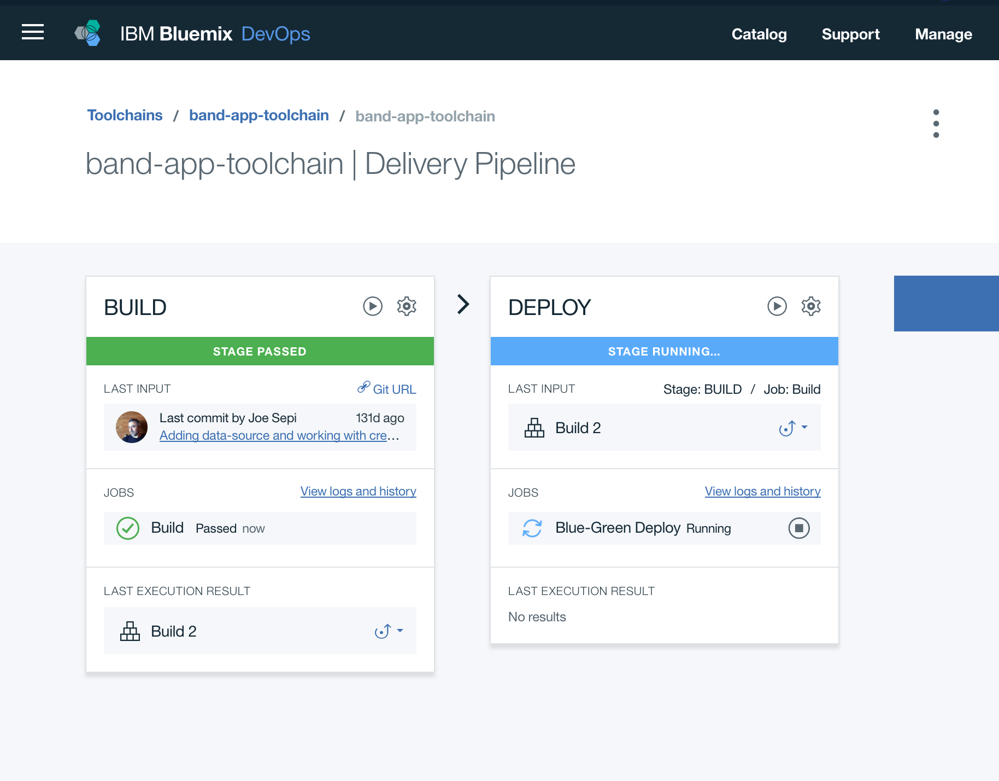

In this series, we are working through building an application to support the needs of DIY bands. We'll start out solving some basic problems and move into more complex ground, eventually transforming the application into a platform that others can use and build upon.

Accompanying this series is a [corresponding workshop](https://github.com/StrongLoop-Evangelists/workshop-band-app) as well as a [code repository](https://github.com/StrongLoop-Evangelists/band-app).

## Previously on _Let's build a band app!_

In the [previous episode](/strongblog/lets-build-a-band-app-loopback-pt6/), we needed to hide our secrets. If we were to commit our credentials to a public repository, our application could easily be compromised. This is something we do not want! So we used a couple tricks to keep our credentials out of public view but allowed our application to access them easily.

## In this episode

In this episode, we will institute some basic devops tooling to allow us to focus on our development and worry less about integrating and deploying our code. With the right toolchain in place, we have the satisfaction of knowing that when we merge our code into master (preferably from a pull request) that a process is kicked off to build, test and deploy our application. Tooling is key to having a successful workflow for you and your team.

<!--more-->

## CI/CD

There are a number of options out there to enable continuous integration and continuous deployment, including open source solutions that you can host, configure and manage as well as companies and services that handle varying amounts of the work for you. I am going to walk through setting up a "toolchain" on Bluemix, IBM's cloud platform, but the underlying concepts should be similar regardless of which path you choose.

The great part about using Bluemix is that it is quite simple!

### Let's get started

We start by going to Toolchains within the DevOps section of Bluemix.

https://console.bluemix.net/devops/toolchains

### Create a Toolchain:

From the page above, we can see any previous toolchains we may have set up. To create a new toolchain, click the Create a Toolchain button.

Doing so will take us to the page where we can choose from the different types of toolchains available to us:
https://console.bluemix.net/devops/create

### Simple Cloud Foundry toolchain

Choose the Simple Cloud Foundry toolchain, which will take us to this page:
https://console.bluemix.net/devops/setup/deploy?repository=https%3A%2F%2Fgithub.com%2Fopen-toolchain%2Fsimple-toolchain

This open toolchain is based off of this template: https://github.com/open-toolchain/simple-toolchain

If you scroll down, you will see this diagram:

Here we can imagine the cycle between "think" and "code" where we are able to iterate on the development of our application and on every merge to master, the "deliver" pipeline fuels our "run" runtime on Bluemix.

Notice that there is also an integrated web IDE that comes along with this toolchain, which is pretty sweet if you ever need it. I prefer to develop locally, but in a pinch---if a build fails or there is some reason you need to quickly edit code---you can get on any machine with an internet connection and get work done.

Also, in the above image, we will find the field to name our toolchain.

### Configuration

If we scroll down further, we get to the configuration options for how our toolchain connects with our code.

We will be using Github and we will link to an existing repository (choose Repository type: Existing).

In the next field we choose our repository. If you have given IBM Bluemix access to your Github account then you should see your repos listed in that dropdown. For me, I prefer to use an upstream repository within the StrongLoop Evangelists' Org on Github. This way, our whole team can contribute and everyone makes pull requests to master "upstream". Because of this difference, I have to paste in my repository URL.

*Note: this field is looking for a github repository and will give you an error if the URL contains a slash at the end. I believe it is looking for the `.git` within your repository and takes issue when it looks like a directory with the slash.*

From here, we can click on the Delivery Pipeline box and see our pipeline in action:

If we commit code to our repository, this pipeline should be kicked off. If we want to run it manually, we can click the little play button. Once our code is built and those build artifacts are deployed, we can see our site live.

Toolchains and pipelines allow us to stop worrying about deployment and allows us to focus on writing code and getting things done. I always try to automate any repetitive tasks and this is the perfect example. Have a machine do this for us and stick with building features and fixing bugs.

## What's Next?

Eagle-eyed readers will have noticed that this entry was part 7 of 8, while this series was originally launched as having "many" parts. The next part will be a natural stopping point for Phase One of building a band app - and you will have a functional band app ready to run. We've also updated past entries to mention the 8 parts.

I don't have Phase Two planned at the moment. I want to go build out this application / platform further and get users on board. Then I will come back and share more about what I've built and how others can do so too. I'll be sure to document all the pains and the joys, so stay tuned and thanks for following along. Cheers!
