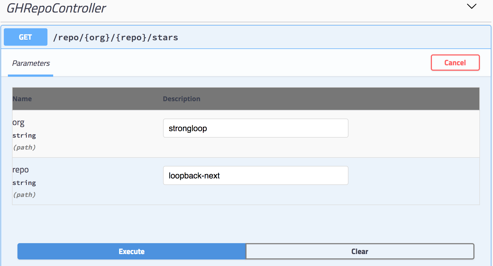
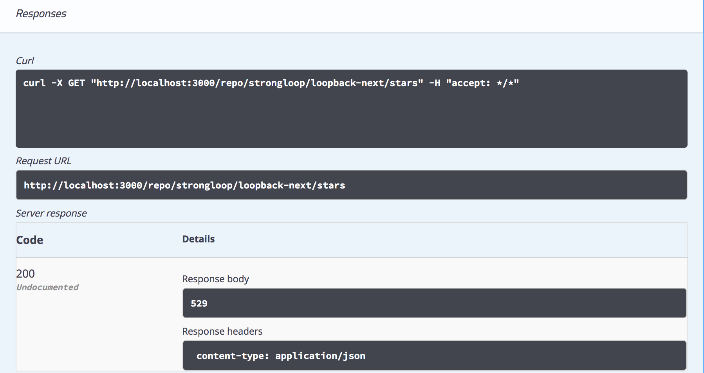

In this series, we will work through creating a basic LoopBack 4 application that exposes REST APIs, calls out to GitHub APIs through [octokat.js](https://github.com/philschatz/octokat.js) (a GitHub API client) to get the number of stargazers on a user-specified GitHub organization and repository, and persists the data into a Cloudant database.

## Let's continue
In [Part 1](https://strongloop.com/strongblog/loopback4-github-example-app-part1/) of this blog post series, we have created a LoopBack 4 application and created a REST endpoint in `GHRepoController` that takes GitHub organization and repository as the path parameters.  We'll continue by adding logic to the `getRepoStargazers` function in `GHRepoController`.

<!--more-->

### Step 1: Creating `creds.ts` for credentials used in octokat.js
[octokat.js](https://www.npmjs.com/package/octokat) is a GitHub API client that makes it easier to talk to GitHub APIs.  In this application, we are going to use Basic Authentication to access GitHub for the number of stargzers for a given repo.

Add a file `creds.ts` at the root of the project. 

The content should look like:
```ts
export const creds = 
{
    username: 'your-github-id@domain.com',
    password: 'your-github-password'
};
```

_**Important**_: 
- If you are going to put this application on GitHub, make sure you add the file `creds.ts` in `.gitignore` file so that it will not be pushed to the repo. 
- Storing the credentials in `creds.ts` is a quick way to get things going.  It is not meant to be used for production deployment.

### Step 2: Preparing `Octokat` object to be used in GHRepoController

In `GHRepoController` (located in `src/controllers/gh-repo.controller.ts`), add the following snippet right below the import statements.
```ts
import {creds} from '../../creds';
const Octokat = require('octokat');

const octo = new Octokat(creds);
```

Don't forget to install `octokat` module by running:
```
npm i --save octokat
```

### Step 3: Retrieving the stargazer numbers in the GHRepoController

To retrieve the number of stargazers a repo has, we can refer to the [GitHub Repositories API](https://developer.github.com/v3/repos/#get). 
`GET /repos/:owner/:repo` returns information about the repo, and the attribute `stargazersCount` is the stargazer number we're looking for.  This endpoint can be reached through the octokat module by calling `await octo.repos(org, repo).fetch()`.

In `GHRepoController`, we are going to update `getRepoStargazers` function:

1. make it async, because the operation does not return the result instantly and we don't want it to block the application.
2. call `octo.repos(org, repo).fetch()` to get information from the repo

Add this import statement at the top:
```ts
const debug = require('debug')('gh-repo');
```

Modify `getRepoStargazers` function: 
```ts
@get('/repo/{org}/{repo}/stars') 
  async getRepoStargazers(
    @param.path.string('org') org: string,
    @param.path.string('repo') repo: string
  ): Promise<number> {
    debug('org/repo: ', org, repo);
    const repoContent = await octo.repos(org, repo).fetch();
    return repoContent.stargazersCount;
  }
```

### Step 4: Let's test our API 
Run the command `npm start` to start the application.
Go to the API Explorer by entering this url in the browser:
```
http://localhost:3000/swagger-ui
```

Select `GHRepoController` > `GET /repo/{org}/{repo}/stars`, and in the parameters fields, type your favorite GitHub repo for the number of stargazers. 



You should be able to see the results in the response section.




_Tip_: You can make the LoopBack application show more debug statements by starting the app with `DEBUG=loopback:* npm start` command. 

## What's Next?

In part 3, we will finish the application by persisting the data we got in this article into a Cloudant database.

## Code repository
The code repository can be found [here](https://github.com/dhmlau/loopback4-github-app).
The `part2` branch has everything accomplished in this article. 
```
git clone https://github.com/dhmlau/loopback4-github-app.git
git checkout part2
```

## Call for Action
LoopBack's future success counts on you. We appreciate your continuous support and engagement to make LoopBack even better and meaningful for your API creation experience. Please join us and help the project by:

* [Open a pull request on one of our "good first issues"](https://github.com/strongloop/loopback-next/labels/good%20first%20issue)
* [Casting your vote for extensions](https://github.com/strongloop/loopback-next/issues/512)
* [Reporting issues](https://github.com/strongloop/loopback-next/issues)
* [Building more extensions](https://github.com/strongloop/loopback-next/issues/647)
* [Helping each other in the community](https://groups.google.com/forum/#!forum/loopbackjs)
