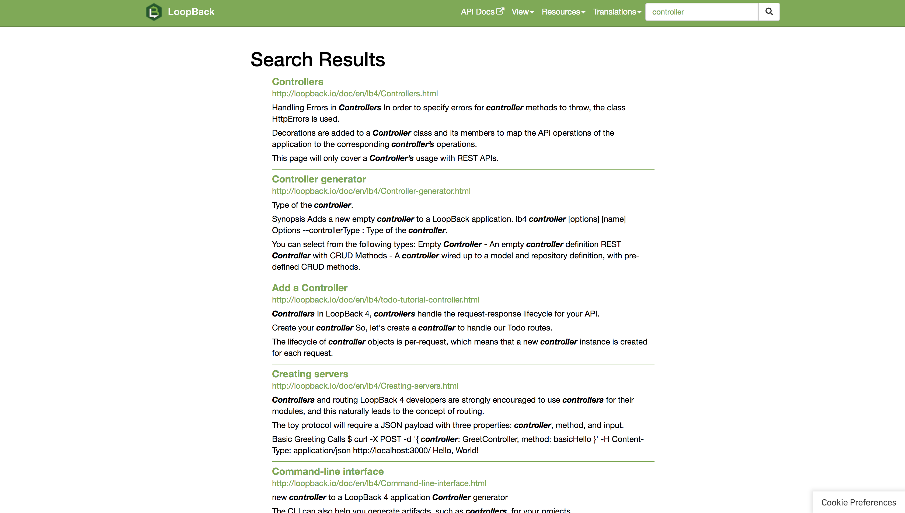

When you have over a 1000 pages of documentation, it becomes a necessity to be able to search the documentation to find relevant content. [LoopBack documentation](http://loopback.io/doc/) search is now powered by [IBM Watson Discovery](https://www.ibm.com/watson/services/discovery/) instead of Google Custom Search. Read on to learn more about the new search.

<!--more-->

Google Custom Search has a few issues -- namely ads in search results and lack of context around a search (Searching in LoopBack 3 docs will show results for all versions of LoopBack, etc). 

## Alternatives Considered

### Lunr.js

[lunr.js](https://lunrjs.com/) is a great indexing library with support for multiple languages that was explored as an alternative but LoopBack documentation is over 1000 pages. The pre-built index was over 9MB, compressed was still over 4MB. This alone was reason enough for us to not use this but there were also concerns raised in the library's repository stating site would become unresponsive on mobile devices if index size was over 1MB. 

### Elasticsearch

Another solution that was considered was Elasticsearch, a full-text search engine. It's one of the most popular solutions to consider when trying to implement full-text search. While this would've been a great solution, it would've required us to maintain the Elasticsearch server. We opted to not pursue this option because of the maintenance effort that we would rather dedicate to LoopBack Development and Support.

### Duck Duck Go Custom Search

A privacy minded search engine alternative to Google that similarly also provides custom search but a quick test showed it would've still served ads. It also lacked context aware search and as such this was dropped as an alternative.

### Watson Discovery

[IBM Watson Discovery](https://www.ibm.com/watson/services/discovery/) allows search queries to be filtered based on some additional metadata (in our case LoopBack version) and doesn't serve any ads. Watson Discovery met the criteria for our new search and since last week has been powering the [LoopBack Docs](http://loopback.io/doc/) search. Try it out for yourself! 

## Implementation

Implementing a new search presented some challenges such as keeping Watson up-to-date, making results context aware (on a static website), a new search results page and a way to query the search results from Watson without credentials.

### Proxy Search Function

Watson Discovery doesn't provide readonly credentials and as such can't be called directly from  the front end and instead requires the use of a proxy service. The proxy was implemented as a serverless function deployed on [IBM Cloud Functions](https://www.ibm.com/cloud/functions). This offers a simple solution that is easy to maintain, scale and use while hiding the Watson Discovery credentials. The proxy function code can be viewed in the new [strongloop/loopback.io-search](https://github.com/strongloop/loopback.io-search) repository.

### Context Aware Search

You can now search for a word from the home page and the search results will include results from all versions of LoopBack. But if you are in the documentation for a particular version of LoopBack, searching from that page will only show results relevant to that version (version context -- set as the sidebar value on each page as a hidden form input).

An example is searching for the word `controller`:
- From the [docs home page](http://loopback.io/doc/) it returns [250 results](http://loopback.io/search/?q=controller&offset=0)
- From the [LoopBack 4 home page](http://loopback.io/doc/en/lb4/index.html) it returns only [39 results](http://loopback.io/search/?q=controller&sidebar=lb4_sidebar&offset=0)

### Auto-deploy

Whenever changes are merged to the `gh-pages` branch for [`loopback.io` repository](https://github.com/strongloop/loopback.io), Travis CI is used to upload the documentation to Watson Discovery into a new collection. Once the collection is ready for use, the older collection is deleted and the search proxy uses the only collection it has available (or the oldest collection if multiple exist). This automation allows the search to always be up-to-date and requires no maintenance effort from the team.

### Search results page

The last part of implementing a new search was a new search results page as this was something previously handled by the Google Custom Search. The new search results page shows 10 results with up to 3 matching sentence excerpts with the matching text bolded. The link for the result page is also shown. The new search results page also makes it possible to share search result page URLs with others. When displaying results, special care had to be taken to ensure results are escaped for any malicious code to prevent XSS attacks as the documentation is open source.

## Happy Searching

Try out the new search in the [docs](http://loopback.io/doc/) and [share your feedback](https://github.com/strongloop/loopback.io/issues/new) with the team for further improving it. 

## Call for Action

LoopBack's future success counts on you. We appreciate your continuous support and engagement to make LoopBack even better and meaningful for your API creation experience. Please join us and help the project by:

* [Open a pull request on one of our "good first issues"](https://github.com/strongloop/loopback-next/labels/good%20first%20issue)
* [Casting your vote for extensions](https://github.com/strongloop/loopback-next/issues/512)
* [Reporting issues](https://github.com/strongloop/loopback-next/issues)
* [Building more extensions](https://github.com/strongloop/loopback-next/issues/647)
* [Helping each other in the community](https://groups.google.com/forum/#!forum/loopbackjs)
