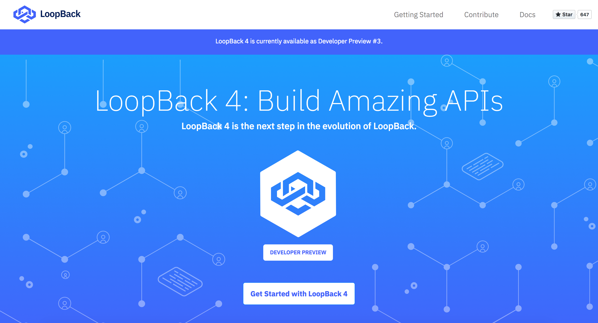
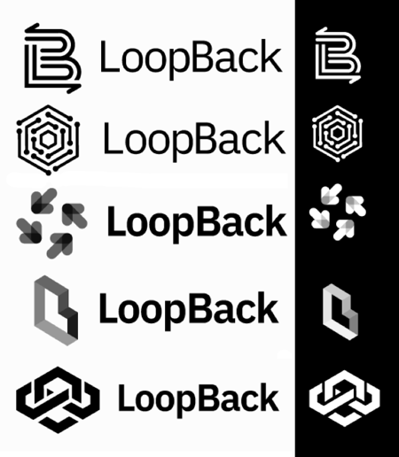
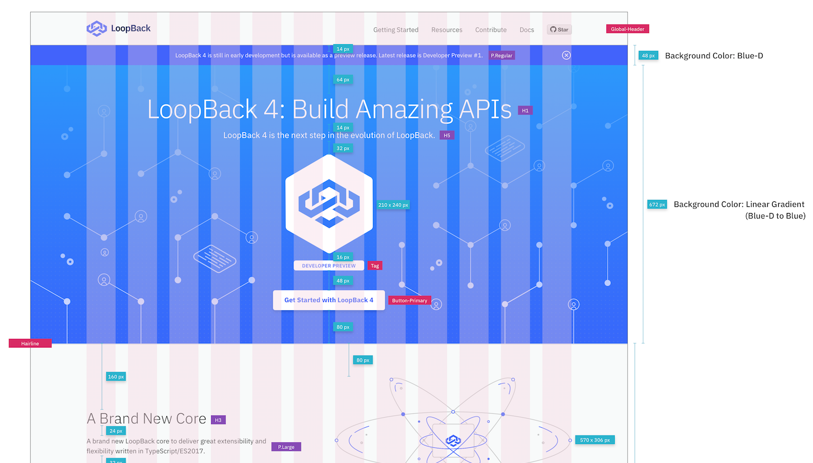

In our [May milestone update](https://strongloop.com/strongblog/may-2018-milestone/), we introduced a new and shiny website dedicated to LoopBack 4. Check it out here: [v4.loopback.io](http://v4.loopback.io/).

<!--more-->

## The Journey

### The Idea

Back when development of LoopBack 4 first started, the team knew that a new codebase should be accompanied by a new logo and branding dedicated to this new version. It was put aside while we focused on delivering the code until recently.

### The Logo

Late last year, we asked our designer [Cody Cai](https://strongloop.com/authors/Cody_Cai/) to come up with a few alternatives.

The general goal for the logo was to have a refreshed look while keeping the vision of the original LoopBack logo and the fact that we're part of the Node.js ecosystem. Based on our original LoopBack logo, we drew upon the key themes of continuity, structure and connection as the foundation for the visual realignment on the new logo.

Since LoopBack is an open source project with a big community, we felt there was a need to get the feedback from our community. With help from [Dave Whiteley](https://strongloop.com/authors/Dave_Whiteley/), we opened a [poll](https://strongloop.com/strongblog/new-loopBack-logo/) in December 2017 asking the community to help us decide on a new logo. And we weren't disappointed! The majority voted for this logo and palette:

### Website

The work hasn't stopped here. Our designer helped us design a brand new website dedicated for LoopBack 4 based on the new logo and color palette. Here is one of the blueprints:

## Design Decision

Since this is a brand new website, we've considered various options:

### URL - v4.loopback.io vs loopback.io/v4

When deciding on the URL scheme for LoopBack 4, we had the following requirements:

- There will be no changes to current LoopBack website.
- People will still be able to access the documentation of older LoopBack versions after v4 release.
- Existing documentation URLs must remain unchanged to ensure shared links won't be broken.
- Ease of maintenance.

One option we considered was having a new subdomain (v4.loopback.io) which implies we need a new GitHub Pages repo. This option allows us to provide a cleaner separation of the old and the new website. The proposed plan is that once LoopBack 4 goes GA (target for later this year), [v4.loopback.io](v4.loopback.io) will become [loopback.io](loopback.io).

An alternative was to group the LoopBack 4 content under a subdirectory (i.e. loopback.io/v4). This option allows easier maintainence of the website because all the new files will reside in the same loopback.io repo and we can continue to use the existing infrastructure for the new site. The downside of this approach is that it could've put the stable code for `loopback.io` at risk of unintentional changes.

In the end, the team was in favor of having [v4.loopback.io](v4.loopback.io). A new repo gives us a clean slate for the development of the new site without risk of breaking the current site, especially because it is a new theme. It also gives us an opportunity to explore a new architecture for the site, such as [VuePress](https://vuepress.vuejs.org/) or [Hexo](https://hexo.io/).

### Bootstrap vs Other Web UI Framework

Since [v4.loopback.io](v4.loopback.io) is a relatively static website, it would've been an overkill to use Web UI frameworks like [Angular](https://angular.io/) and [React](https://reactjs.org/). As a result, we decided to use [Bootstrap](https://getbootstrap.com/) to build the responsive new website easily.

## Your Contribution is Welcomed!

As you may have noticed, only the landing page is done. The next step is to add a static site generator, such as [VuePress](https://vuepress.vuejs.org/), and implement the rest of the pages according to the [blueprints](https://github.com/strongloop/v4.loopback.io/tree/master/blueprint). If you're interested in taking the website to the next level, you can contribute over at this GitHub repo: [github.com/strongloop/v4.loopback.io](github.com/strongloop/v4.loopback.io).

Here is how you can help:

- [Let us know](https://github.com/strongloop/v4.loopback.io/issues) if there is something you'd like to see
- Implement content or fix bugs according to the [blueprints](https://github.com/strongloop/v4.loopback.io/tree/master/blueprint).
