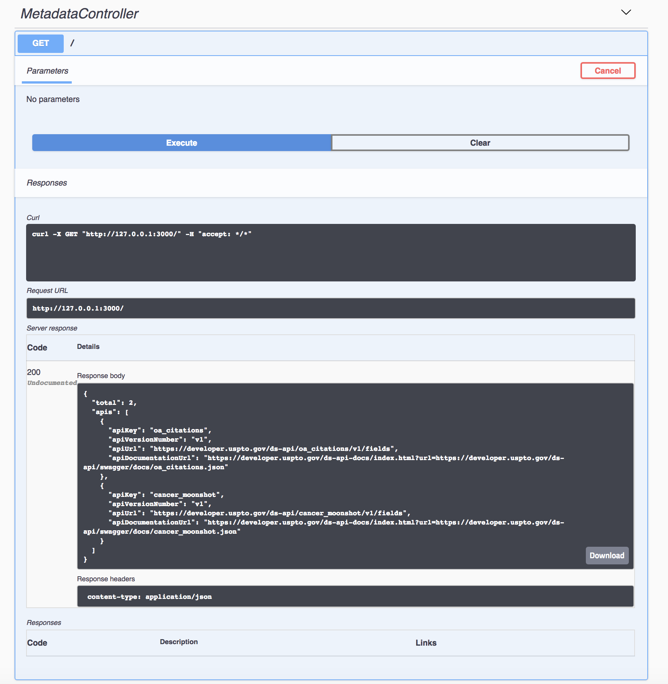

LoopBack - both the team and the framework - has been a longtime advocate and adopter of open API standards. For 3.x versions of the OpenAPI Specification, the framework uses [Swagger 2.0] to power the API explorer since its first release. The CLI also provides [lb swagger] command to automatically generate LoopBack artifacts from Swagger documents as the starting point of fully functional API implementations.

The [OpenAPI Specification 3.0.0] was released in July 2017. We have [embraced it for our API creation experience] with LoopBack 4 so that developers can simply create APIs as TypeScript classes and methods and decorate them with OpenAPI 3.0.x compatible metadata. It's so called code-first or bottom-up approach. What about starting with an API design specification? API consumers and providers often want to discuss, understand, and agree on the APIs as a contract first, before building code for either the client or server. To support that, we’re excited to announce the availability of the `lb4 openapi` command which can generate LoopBack 4 controllers and models that expose APIs conforming to the OpenAPI specification.

In sections below, we'll illustrate how easy it is to create REST APIs in Node.js from an OpenAPI specification using LoopBack 4. Let's start the journey by first creating an empty LoopBack 4 application.

[swagger 2.0]: https://github.com/OAI/OpenAPI-Specification/blob/master/versions/2.0.md
[lb swagger]: https://strongloop.com/strongblog/enterprise-api-swagger-2-0-loopback/
[embraced it for our API creation experience]: https://strongloop.com/strongblog/upgrade-from-swagger-to-openapi-3/
[swagger generation]: https://strongloop.com/strongblog/generating-swagger-openapi-specification-from-your-loopback-application/
[openapi specification 3.0.0]: https://www.openapis.org/blog/2017/07/26/the-oai-announces-the-openapi-specification-3-0-0

<!--more-->

## Try out the openapi command

### Install LoopBack 4 CLI

Before we start, please make sure you have LoopBack 4 CLI installed:

```sh
npm install -g @loopback/cli
```

### Scaffold a Loopback Application

The first step is to create a blank LoopBack application named `openapi-demo`.

```sh
lb4 openapi-demo
```

### Generate APIs from OpenAPI Specs

Now let’s try to generate APIs from OpenAPI specs. In this demo, we use [uspto OpenAPI spec](https://raw.githubusercontent.com/OAI/OpenAPI-Specification/master/examples/v3.0/uspto.yaml) as an example. You can also try your own specs or some examples below:

- https://raw.githubusercontent.com/OAI/OpenAPI-Specification/master/examples/v3.0/uspto.yaml
- https://raw.githubusercontent.com/OAI/OpenAPI-Specification/master/examples/v3.0/petstore-expanded.yaml
- https://api.apis.guru/v2/specs/api2cart.com/1.0.0/swagger.json
- https://api.apis.guru/v2/specs/amazonaws.com/codecommit/2015-04-13/swagger.json

```sh
cd openapi-demo
lb4 openapi https://raw.githubusercontent.com/OAI/OpenAPI-Specification/master/examples/v3.0/uspto.yaml
```

The generator loads the spec and discovers models and apis. It then prompts you to select from the list of controllers to be created from tags.

```
Loading https://raw.githubusercontent.com/OAI/OpenAPI-Specification/master/examples/v3.0/uspto.yaml...
? Select controllers to be generated: (Press <space> to select, <a> to toggle al
l, <i> to invert selection)
❯◉ [metadata] MetadataController
 ◉ [search] SearchController
```

Two controllers and one model classes are generated:

- `src/controllers/metadata.controller.ts`
- `src/controllers/metadata.search.ts`
- `src/models/data-set-list.model.ts`

## Mapping an OpenAPI Spec to TypeScript Artifacts

What's happening behind the scene? The `lb4 openapi` command loads the OpenAPI spec and maps definitions to LoopBack 4 artifacts as follows.

### Operation Mapping

Mapping REST endpoints from the OpenAPI spec into LoopBack 4 raises some challenges. As we know, LoopBack 4 uses controllers to define methods that are mapped to HTTP routes as REST APIs. Each controller represents a resource and its available operations.

Unfortunately OpenAPI does not have the resource concept to group related operations. It's also hard to infer them from the path urls. The good news is that `tags` are there to rescue the day.

```yaml
tags:
  - name: metadata
    description: Find out about the data sets
  - name: search
    description: Search a data set
paths:
  /:
    get:
      tags:
        - metadata
      operationId: list-data-sets
      ...
  /{dataset}/{version}/fields:
    get:
      tags:
        - metadata
      operationId: list-searchable-fields
      ...
  /{dataset}/{version}/records:
    post:
      tags:
        - search
      operationId: perform-search
      ...  
```

We now generate two controllers:

1.  MetadataController (for tag `metadata`)
    - listDataSets()
    - listSearchableFields()

```ts
import {operation, param, requestBody} from '@loopback/rest';
import {DataSetList} from '../models/data-set-list.model';

/**
 * The controller class is generated from OpenAPI spec with operations tagged
 * by metadata (<-- tag name)
 * Find out about the data sets (<-- tag description)
 */
export class MetadataController {
  constructor() {}

  /**
   *
   *
   * @returns Returns a list of data sets
   */
  @operation('get', '/') // (<-- path & verb)
  async listDataSets(): Promise<DataSetList> {
    throw new Error('Not implemented');
  }

  /**
   * This GET API returns the list of all the searchable field names that are in the oa_citations. Please see the 'fields' attribute which returns an array of field names. Each field or a combination of fields can be searched using the syntax options shown below.
   *
   * @param dataset Name of the dataset. In this case, the default value is oa_citations
   * @param version Version of the dataset.
   * @returns The dataset api for the given version is found and it is accessible to consume.
   */
  @operation('get', '/{dataset}/{version}/fields')
  async listSearchableFields(
    @param({name: 'dataset', in: 'path'})
    dataset: string,
    @param({name: 'version', in: 'path'})
    version: string,
  ): Promise<string> {
    throw new Error('Not implemented');
  }
}
```

2.  SearchController (for tag `search`)
    - performSearch()

```ts
import {operation, param, requestBody} from '@loopback/rest';

/**
 * The controller class is generated from OpenAPI spec with operations tagged
 * by search
 * Search a data set
 */
export class SearchController {
  constructor() {}

  /**
   * This API is based on Solr/Lucense Search. The data is indexed using SOLR. This GET API returns the list of all the searchable field names that are in the Solr Index. Please see the 'fields' attribute which returns an array of field names. Each field or a combination of fields can be searched using the Solr/Lucene Syntax. Please refer https://lucene.apache.org/core/3_6_2/queryparsersyntax.html#Overview for the query syntax. List of field names that are searchable can be determined using above GET api.
   *
   * @param body
   * @param version Version of the dataset.
   * @param dataset Name of the dataset. In this case, the default value is oa_citations
   * @returns successful operation
   */
  @operation('post', '/{dataset}/{version}/records')
  async performSearch(
    @requestBody() body: any,
    @param({name: 'version', in: 'path'})
    version: string,
    @param({name: 'dataset', in: 'path'})
    dataset: string,
  ): Promise<{}[]> {
    throw new Error('Not implemented');
  }
}
```

### Schema Mapping

OpenAPI 3.0.x specs use `schema` to describe data types/models. There are a few cases that we have to handle to map them to TypeScript classes or types.

1.  Named vs. Anonymous Schemas

Named schemas are defined as child objects of `components.schemas`. For example,

```yaml
components:
  schemas:
    dataSetList:
      type: object
      properties:
        total:
          type: integer
        apis:
          type: array
          items:
            type: object
            properties:
              apiKey:
                type: string
                description: To be used as a dataset parameter value
              apiVersionNumber:
                type: string
                description: To be used as a version parameter value
              apiUrl:
                type: string
                format: uriref
                description: "The URL describing the dataset's fields"
              apiDocumentationUrl:
                type: string
                format: uriref
                description: A URL to the API console for each API
```

Please note a schema named `dataSetList` is defined as an object type and it has properties `total` and `apis`. The `apis` itself is an array of an anonymous object type:

```ts
class dataSetList {
  total: number;
  apis: {
    apiKey: string;
    apiVersionNumber: string;
    apiUrl: string;
    apiDocumentationUrl: string;
  }[];
}
```

Please note that anonymous schemas can show up as embedded schema definitions for other OpenAPI objects, such as parameters and responses.

2.  Various data types

OpenAPI Specification allows various data types, such as simple types, object types, array types, and composite types. Types can also be referenced using `$ref`.

- Simple types

```yaml
components:
  schemas:
    Name:
      type: string
    Color:
      type: string
      enum:
        - red
        - green
        - blue  
```

```ts
export type Name = string;
export type Color = 'red' | 'green' | 'blue';
```

- Object types

```yaml
components:
  schemas:
    NewPet:
      required:
        - name
      properties:
        name:
          type: string
        tag:
          type: string
```

```ts
export class NewPet {
  name: string; // required
  tag?: string; // optional
}
```

- Array types

```yaml
components:
  schemas:
    NameList:
      type: array
      items:
        type: string
```

```ts
export type NameList = string[];
```
- Composite types

```yaml
components:
  schemas:
    Pet:
      allOf:
        - $ref: '#/components/schemas/NewPet'
        - required:
          - id
          properties:
            id:
              type: integer
              format: int64
    NewPet:
      required:
        - name
      properties:
        name:
          type: string
        tag:
          type: string
```

```ts
export type Pet = {id: number} & NewPet;
```
- Handling references

References to other types via `$ref` are honored. For example, `$ref: '#/components/schemas/NewPet'` will be mapped to an import of `NewPet` model class.

The following code is generated from the `dataSetList` sc

```ts
import {model, property} from '@loopback/repository';

/**
 * The model class is generated from OpenAPI schema - dataSetList
 * dataSetList
 */
@model({name: 'dataSetList'})
export class DataSetList {
  constructor(data?: Partial<DataSetList>) {
    if (data != null && typeof data === 'object') {
      Object.assign(this, data);
    }
  }

  /**
   *
   */
  @property({name: 'total'})
  total?: number;

  /**
   *
   */
  @property({name: 'apis'})
  apis?: {
    apiKey?: string;
    apiVersionNumber?: string;
    apiUrl?: string;
    apiDocumentationUrl?: string;
  }[];
}
```

## Check the project

You should see the following artifacts generated in `openapi-demo`:

- `src/controllers`
  - `metadata.controller.ts`
  - `metadata.search.ts`
- `src/models/`
  - `data-set-list.model.ts`

## Run the application

To run the application:

```sh
npm start
```

Open your browser and points to <http://localhost:3000/swagger-ui>.

As you see, the API endpoints defined by the OpenAPI spec is now available from LoopBack!

Let’s give it a try.

Find `MetadataController` -> `GET /`, press `Try it out` and then `Execute`.

Hmm, you get an `500` error saying the api is not implemented. That is expected as the generated method is just a skeleton!

How about adding your implementation? Let's update `openapi-demo/src/controllers/metadata.controller.ts`.

```ts
  @operation('get', '/')
  async listDataSets(): Promise<DataSetList> {
    const ds = new DataSetList();
    ds.total = 2;

    ds.apis = [
      {
        apiKey: 'oa_citations',
        apiVersionNumber: 'v1',
        apiUrl: 'https://developer.uspto.gov/ds-api/oa_citations/v1/fields',
        apiDocumentationUrl:
          'https://developer.uspto.gov/ds-api-docs/index.html?url=https://developer.uspto.gov/ds-api/swagger/docs/oa_citations.json',
      },
      {
        apiKey: 'cancer_moonshot',
        apiVersionNumber: 'v1',
        apiUrl: 'https://developer.uspto.gov/ds-api/cancer_moonshot/v1/fields',
        apiDocumentationUrl:
          'https://developer.uspto.gov/ds-api-docs/index.html?url=https://developer.uspto.gov/ds-api/swagger/docs/cancer_moonshot.json',
      },
    ];
    return ds;
  }
```

Now you can restart the server and try again.



## Supported OpenAPI Versions

The LoopBack 4 openapi generator supports both [2.0](https://github.com/OAI/OpenAPI-Specification/blob/master/versions/2.0.md) and [3.0.x](https://github.com/OAI/OpenAPI-Specification/blob/master/versions/3.0.1.md) versions.

## Summary

With the OpenAPI generator, we've now completed a round trip of API creation:

- Start with a OpenAPI spec
- Generate corresponding artifacts for your LoopBack 4 application
- Implement the controller methods
- Play with the live APIs served by LoopBack 4 using the explorer

## Call for Action

LoopBack's future success depends on you. We appreciate your continuous support and engagement to make LoopBack even better and meaningful for your API creation experience. Please join us and help the project by:

- [Open a pull request on one of our "good first issues"](https://github.com/strongloop/loopback-next/labels/good%20first%20issue)
- [Casting your vote for extensions](https://github.com/strongloop/loopback-next/issues/512)
- [Reporting issues](https://github.com/strongloop/loopback-next/issues)
- [Building more extensions](https://github.com/strongloop/loopback-next/issues/647)
- [Helping each other in the community](https://groups.google.com/forum/#!forum/loopbackjs)
