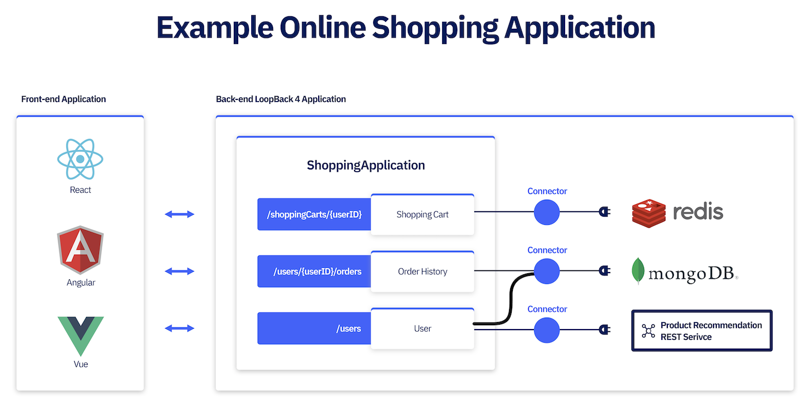
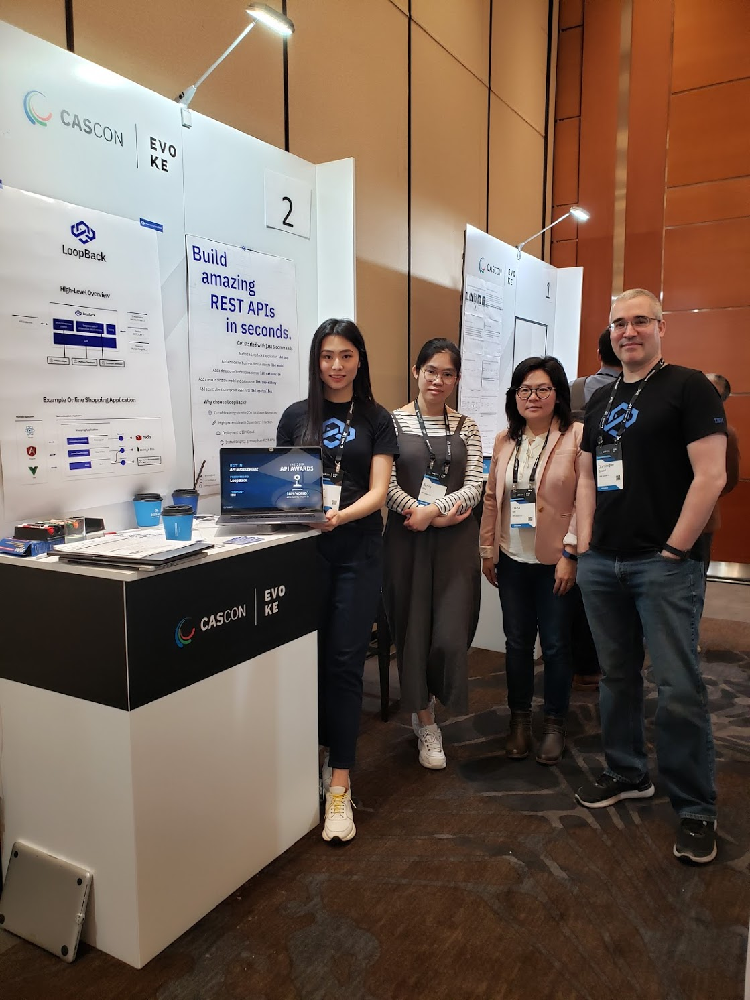
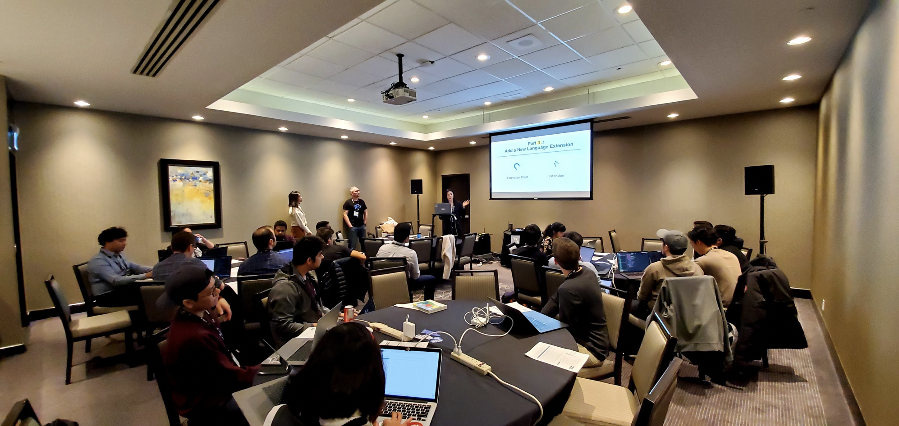
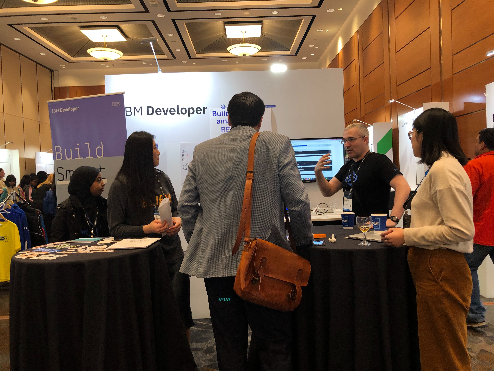

[CASCONxEVOKE](https://www-01.ibm.com/ibm/cas/cascon/) is one of Canada’s largest combined academic, research and developer conferences—welcoming 1,500+ attendees and over 150+ speakers. This year, the LoopBack team has been busy in collaborating with other attendees at the booth and delivering workshop at the conference during November 4 to 6 in Markham Ontario.

<!--more-->

  

### Day 1: Booth Showcasing Fast and Easy API Creation with LoopBack 

It's a great opportunity for us to collaborate with other attendees at our [booth](https://pheedloop.com/cascon/site/sessions/?id=DugCzZ), showing how LoopBack can make API creation fast and easy. It looks like the use case we've shown in our poster is a common use case for our attendees to biuld APIs! 

  

Besides, we got a few questions about exposing GraphQL in LoopBack. If you're interested in it too, see [our tutorial](https://loopback.io/doc/en/lb4/exposing-graphql-apis.html) which uses [OpenAPI-to-GraphQL module](https://loopback.io/openapi-to-graphql.html). 

  

### Day 2: Workshop on Writing Scalable Node.js Applications Using LoopBack

On Day 2, we have a [workshop](https://pheedloop.com/cascon/site/sessions/?id=OhNsKW) about writing scalable and extensible Node.js applications using LoopBack 4. We presented the challenges we faced for LoopBack as a large scale Node.js framework and showed how those challenges were being addressed in LoopBack 4. While we're introducing the concepts that make scalability and extensibility possible (such as Dependency Injection, extension/extension-point framework and Inversion of Control), the attendees also had a chance to step-by-step build an extensible and scalable Node.js application using those features. 

We won't be able to relive the workshop, but you can check out our workshop [hands-on exercise instructions](https://github.com/strongloop/cascon2019) and [presentation slides](https://github.com/strongloop/cascon2019/blob/master/2019cascon-workshop-presentation-pdf.pdf).

### Day 3: IBM Developer Booth

Throughout the conference, the IBM Developer booth was showcasing different developer-focused technologies, such as Appsody and LoopBack. We were delighted to be there on Day 3 to reach out more existing and potential users!

  

